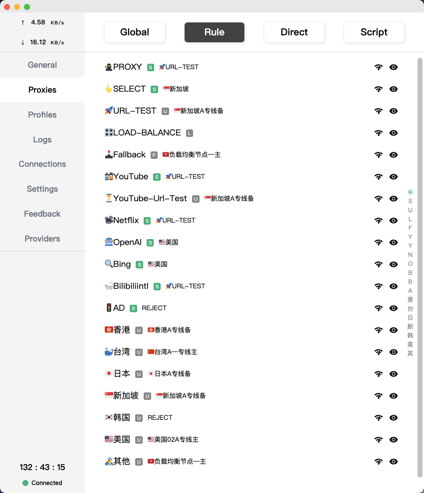

# Parsers for clash  
 
 一直没找到一个满足自己需求的预处理配置，陆陆续续按照网络上的各种版本修改-测试，也慢慢理解了编写的语言规则，渐渐形成这个好用的版本，和大家共享❤️️，有建议的欢迎留言😄
 
# 主要功能特色
- 自带测速选择（机场各节点、YouTube可单独测速优选）
- 按国别测速分组(按国别分组)
    - 美国
    - 日本
    - 台湾
    - 新加坡
    - 韩国
    - 香港
    - 其它
- 可独立选择机场
    - Openai
    - Bing（2023-04-08添加，可用new bing）
    - Google（2023-05-06添加，强化谷歌线路的一致化，可以找Bard聊天了💬）
    - Netflix
    - YouTube
    - Bilibili国际版（2023-04-08添加）
    - Twitter（2023-05-18添加，以应对机场的某些线路限制）
- 线路规划
    - GitHub
- 广告屏蔽

# 界面效果

# 用法
直接复制parsers.yml的内容到clash的“setting--profiles--parsers”中，执行“profiles”的连接更新即可
ps：我用的是Clash for Windows

# 特别鸣谢
来自网络的各方力量
（按照内容更新，陆续更新技术贡献的各方名录）

@blackmatrix7[blackmatrix7/ios_rule_script: 分流规则、重写写规则及脚本。](https://github.com/blackmatrix7/ios_rule_script)

# 推介
如果你的机场不稳定，可以尝试我踩了几个坑后改用的这个
[专线](https://cloud.sstea.men/#/register?code=48erzZ7G)
ps：不要用某莓的机场

# 特别声明
只支持用于网络技术学习研究，一切涉及违法违纪的与本人无关

# 如果有帮助就👇🏻的小广告连接（做测试）
http://lyksoomu.com/188kP
